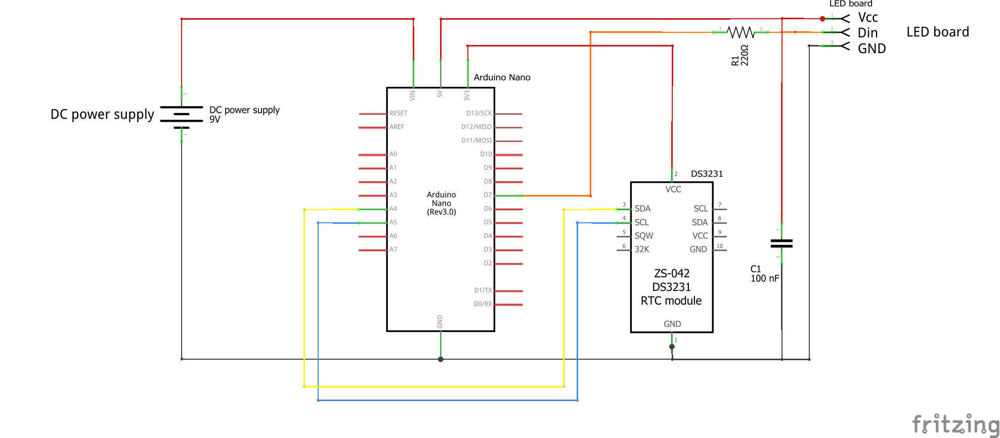
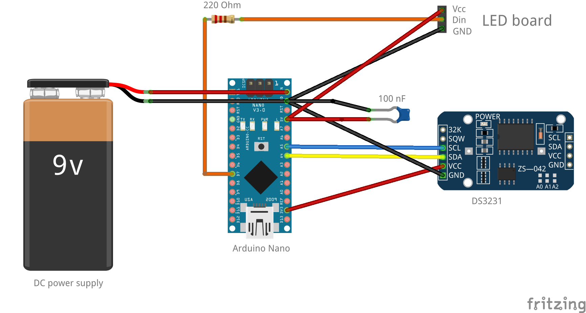

# LED nixie clock with Arduino

## Description
This repository is about a nixie clock based on an Arduino Nano board, an RTC module, and some LED nixie boards. 

## Bill of materials
* Arduino Nano
The small version of the Arduino family to keep the electronics part small and discreet.
* [DS3231 Real time clock (RTS) module](https://www.banggood.com/DS3231-AT24C32-IIC-Precision-RTC-Real-Time-Clock-Memory-Module-p-1547989.html) 
This module is powered by a battery, equipped with a quartz oscillator, and maintains the clock even after being cut off from power. By doing so, the LED clock will not lose the information of the current time, even after plugged out from electricity.
* CR2032 battery
* 4x [LED nixie boards](https://www.led-genial.de/LED-Nixie-M-Einzelmodul-Bausatz)  
with 20 LEDs each(2 LEDs per digit and ten digits)
* 220 ohm resistor
The resistor should be inserted between the Arduino Nano and the LED boards to limit the current on the wire carrying the control signal.
* 100 nF capacitor  
This capacitor stabilizes the power supply and prevents the LEDs from flickering or dimming, when the digits are shifting and the dragged current is changing considerably. Since the LEDs switch quickly, a smaller capacitor might also do the job. Depending on your board and power supply, a capacitor might not be necessary whatsoever.
* Dupont jumper wires
similar to wires like these: https://de.aliexpress.com/item/4000203371860.html

## Libraries
* DS3231.h
This library should be manually downloaded and added to the working directory of the Arduino IDE. More information and the zip file for download available at http://www.rinkydinkelectronics.com/library.php?id=73 
* Adafruit_NeoPixel.h
This library can be directly installed from the library manager of the Arduino IDE. More information available at https://github.com/adafruit/Adafruit_NeoPixel 

## Data sheets
* [DS3231 Real time clock (RTS) module](https://datasheets.maximintegrated.com/en/ds/DS3231.pdf)

## Wiring
The wiring is shown in the following two pictures (schematic view and breadboard view).

## References
Please find some references and related material for further reading below.

* https://create.arduino.cc/projecthub/MisterBotBreak/how-to-use-a-real-time-clock-module-ds3231-bc90fe
* https://www.heise.de/select/make/2018/4/1535076681386192 

